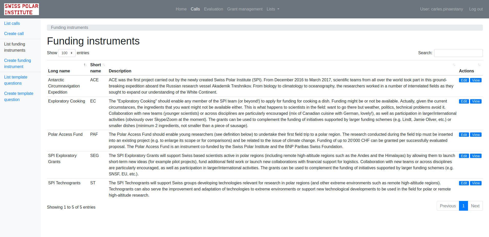

# project-application

Internal in-development application to track proposals and projects from their submission to finalisation.

The application is designed for the SPI (Swiss Polar Institute) process and allows SPI to:

## Calls
SPI can create calls. Calls belong to a Funding Instrument and each Call has a common set of questions (applicant information, area that the project would happen, keywords, etc.) Calls has optional section: budget (with limit of budget), proposal partners and any questions specific per call (based on templates to make them easier to re-use and compare between calls).

People identity is integrated with ORCID.

## Proposals
Applicants create proposals for the existing calls. They can save as Draft or Submit. Email notifications to the applicants are sent. When creating the proposal there are lookups on ORCID, the budget is checked to not go over budget, keywords can be created, etc.

## Evaluation
Once the Call is closed the Evaluation starts. SPI marks the proposals as eligible or not eligible. Reviewers have access to the eligible proposals of a given call. An Excel file is generated for the board to evaluate each proposal.

After the board has evaluated the proposals SPI can enter the evaluation output: funded or not funded, letter for the applicant, feedback, etc.

At each stage it's possible to attach comments and attachments. When it makes sense like the eligibility of proposals the history is saved to be able to see who changed what.

The last step of the evaluation happens when the application validates that all the proposals have been evaluated, they have the files attached, fund/not fund marked, etc. and then the projects are created from the proposals.

## Grant Management
This is a small project management system. SPI can enter information for:

### Finances
- Installments

- Invoices (with comments attach to each invoice if needed)

- Financial reports

### Deliverables
- Milestones of any time

- Scientific reports

- Lay summaries (integrated with Web)

- Blog posts (psosibility to integrate them at a later stage)

- Photos and media (holding the copyright, license, received date, etc.)

- Datasets

- Publications

- Social media links

# Screenshots
The application is very interactive: validations happening with all the forms, autocompletion, etc.

Here a few screenshots to see the look and feel:

## List of funding instruments
<table><tr><td>

</td></tr></table>

## List of template questions
<table><tr><td>

</td></tr></table>

## Creating a call for proposals

Used by the admin of the Swiss Polar Institute to create the call

<table><tr><td>

</td></tr></table>

## Proposal main form

Filled in by the researchers to apply for grants

<table><tr><td>

</td></tr></table>

## List of submitted proposals

<table><tr><td>

</td></tr></table>

## List of closed calls

<table><tr><td>

</td></tr></table>

## Details of a submitted proposal

<table><tr><td>

</td></tr></table>

## Management of finances

<table><tr><td>

</td></tr></table>

## Management of deliverables

<table><tr><td>

</td></tr></table>

## Reporting tables

Screenshots to be added
